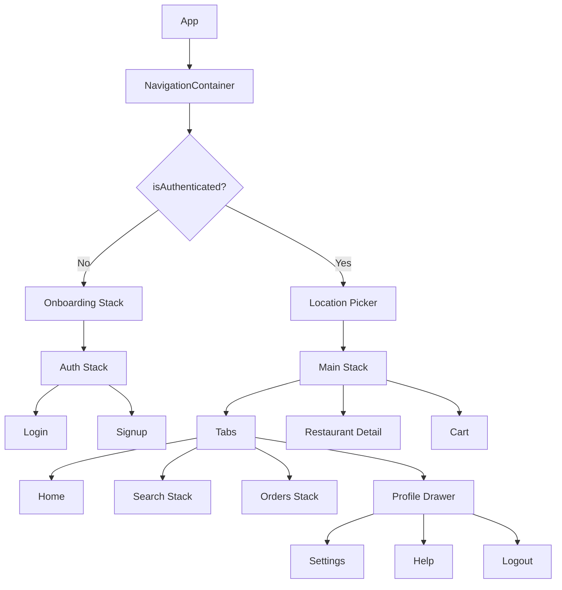

# Food Delivery App

React Native / Expo app for the Mobile Development Cohort assignment. The app focuses on navigation architecture and uses nested navigators to model a complete food delivery flow: onboarding, auth, location selection, bottom tabs, restaurant details, cart, and profile drawer.

## Project Overview

This project is built as a single Expo app with a root navigation container and conditional flows for guest and authenticated users. The main experience includes:

- Onboarding screens with a Get Started entry point
- Login and signup auth flow
- Location selection before entering the app when signed in
- Bottom tabs for Home, Search, Orders, and Profile
- Nested stack navigation inside the main app for Restaurant Detail and Cart
- Drawer navigation inside Profile
- Deep linking support for direct restaurant opening
- Theme-aware UI components and shared mock app state

## Tech Stack

- Expo
- React Native
- React Navigation v7
- TypeScript
- Expo Linking
- React Native Gesture Handler
- React Native Reanimated
- React Native Safe Area Context
- Expo Vector Icons

## How To Run Locally

1. Install dependencies:

```bash
npm install
```

2. Start the Expo dev server:

```bash
npm start
```

3. Run on a device or simulator from the Expo menu.

## Navigation Structure

The app uses a conditional root flow in [src/routes/root.tsx](src/routes/root.tsx):

- Guest flow: Onboarding -> Auth stack
- Authenticated flow: Location -> Main app

The main app is organized in [src/routes/layout.tsx](src/routes/layout.tsx):

- Main stack
  - Tabs
  - Restaurant
  - Cart
- Bottom tabs
  - Home
  - Search
  - Orders
  - Profile
- Nested navigators
  - Search stack
  - Orders stack
  - Profile drawer



### Key Navigation Behaviors

- Onboarding uses a top-tab layout with swipeable feature pages.
- The Get Started button moves forward through onboarding, then redirects into auth.
- Login uses the mock app context to sign in and reveal the authenticated flow.
- Home passes restaurant `id` via params to Restaurant Detail.
- Restaurant Detail can navigate to Cart and supports back navigation.
- Orders shows a badge when the cart is not empty.
- Profile contains a custom drawer with user details and logout.
- Location selection can go back when available, or replace into the main app after selection.
- Deep links route directly to restaurant detail using the restaurant path.

## Deep Linking

The project is configured in [src/App.tsx](src/App.tsx) with the custom scheme `foodie://`.

Supported routes include:

- `foodie://restaurant/:id`
- `foodie://login`
- `foodie://signup`

Example:

```text
foodie://restaurant/123
```

This opens Restaurant Detail directly for the matching restaurant id.

## Screens

- Onboarding flow: [src/screens/onboarding](src/screens/onboarding)
- Auth flow: [src/screens/auth](src/screens/auth)
- Location picker: [src/screens/location](src/screens/location)
- Home tab: [src/screens/(tabs)/home](<src/screens/(tabs)/home>)
- Search tab: [src/screens/(tabs)/search](<src/screens/(tabs)/search>)
- Orders tab: [src/screens/(tabs)/orders](<src/screens/(tabs)/orders>)
- Profile tab and drawer: [src/screens/(tabs)/profile](<src/screens/(tabs)/profile>)
- Restaurant detail: [src/screens/restaurant](src/screens/restaurant)

## Mock State And Assumptions

- Auth state is mocked through the app context in [lib/app_context.tsx](lib/app_context.tsx).
- Cart state and restaurant data are held in local context for demo purposes.
- The current deep-link scheme in the app is `foodie://`.
