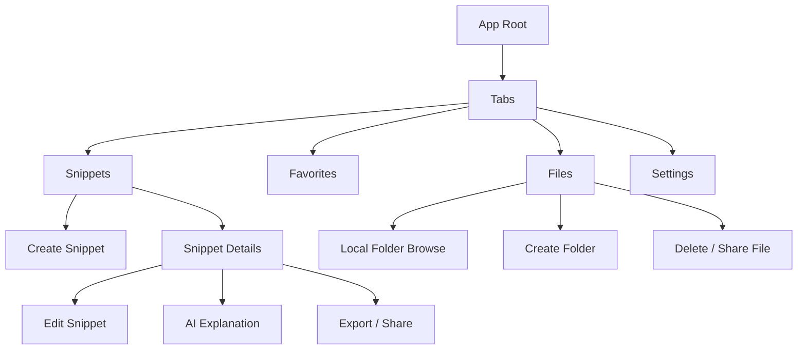

# SnippetVault

React Native / Expo app for the Mobile Development Cohort assignment. SnippetVault is an offline-first developer utility for saving code snippets, organizing them with tags and favorites, browsing local files, and generating AI-powered explanations for selected snippets.

## Project Overview

This project is built with Expo Router and TypeScript and is centered around local-first data access. The app keeps snippet data on-device, lets users manage snippet files through Expo FileSystem, and stores sensitive AI credentials with SecureStore.

The current implementation includes:

- Snippet CRUD for creating, editing, deleting, and viewing code snippets
- Search across snippet title, code, language, and tags
- Favorites for quick access to commonly used snippets
- A detailed snippet view with export and sharing actions
- Local file browsing, folder creation, file deletion, and file sharing
- AI-powered explanations, summaries, and improvement suggestions for any snippet
- Theme switching with persisted user preferences
- Error handling and offline-friendly local state management

## Tech Stack

- Expo
- React Native
- TypeScript
- Expo Router
- Expo SQLite
- AsyncStorage
- SecureStore
- Expo FileSystem
- Expo Sharing
- Expo Clipboard
- React Query
- React Native Markdown Display
- React Native Syntax Highlighter

## Screens

- Home / Snippets: browse, search, and favorite snippets
- Create Snippet: add a new snippet with title, language, tags, and code
- Snippet Details: view code, edit, export, share, delete, and open AI tools
- Edit Snippet: update snippet content and metadata
- Favorites: see only starred snippets
- Files: browse local folders and exported files
- AI Explanation: generate code explanations, summaries, or improvement suggestions
- Settings: manage theme and stored AI API key

## Key Features

### Snippet Management

Snippets are stored as structured records with:

- Title
- Code content
- Programming language
- Tags
- Favorite status
- Created and updated timestamps

The home screen shows searchable snippet cards with a code preview, language badge, tags, and recency information. Users can create, edit, delete, and favorite snippets from the list and detail views.

### Offline Storage

The app is designed to work without an internet connection for its core snippet workflow.

- On native devices, snippets are stored locally with SQLite.
- The database table used by the app stores snippet metadata, code, tags, and favorite state.
- Theme preferences are persisted with AsyncStorage.
- AI keys are stored with SecureStore.
- The file manager operates on the device file system through Expo FileSystem.

#### Snippet Database Structure

The SQLite table used by the app is:

- `id` as the primary key
- `title`
- `code`
- `language`
- `tags` stored as JSON
- `is_favorite`
- `created_at`
- `updated_at`

### File Management

The File screen exposes a local file browser rooted at the app document directory under `SnippetVault/`.

Implemented file actions:

- Browse folders and files
- Create folders
- Delete files or folders
- Share files with other apps
- Save exported snippet text files locally

Exported snippets are saved into `SnippetVault/Exports/` and can be shared immediately after export.

### AI Code Explanation

The AI screen lets the user select one of three analysis modes:

- Explain
- Summarize
- Improve

The app sends the selected snippet and chosen prompt to a streamed AI endpoint after validating that an API key has been saved in SecureStore. The response is rendered in markdown for readability.

### Export & Sharing

From the snippet details screen, users can export the current snippet as:

- `.txt`
- `.js`
- `.json`

Exports are written to local storage first, then shared through the native share sheet when available.

### Theme and Preferences

The app supports system, light, and dark themes. Theme selection is saved locally so it persists across launches.

## Storage Responsibilities

Each storage layer is used for a specific purpose:

- SQLite: snippet records and CRUD operations
- AsyncStorage: theme preference
- SecureStore: AI API key
- Expo FileSystem: local file browsing and exports

## Navigation Structure

The app uses Expo Router with a root stack and a bottom tab layout.

- Root stack: tabs, create snippet, snippet details, edit snippet, AI explanation
- Tabs: Snippets, Favorites, Files, Settings



## Project Structure

- `src/app`: Expo Router screens and navigation layout
- `src/components`: reusable UI building blocks such as cards, search, tags, and code blocks
- `src/contexts`: theme, database, and file-system providers
- `src/hooks`: theme color helpers
- `src/constants`: shared color tokens

## How To Run Locally

1. Install dependencies:

```bash
npm install
```

1. Start the Expo dev server:

```bash
npm start
```

1. Run the app on an Android emulator, iOS simulator, or a physical device from the Expo menu.

## Notes

- The app is intentionally local-first, so snippet creation and browsing remain available offline.
- AI features require a user-provided API key saved from Settings.
- The file manager currently supports browsing, folder creation, deletion, sharing, and local export storage.

## Demo


https://github.com/user-attachments/assets/fcde3cb7-60b5-4479-8588-2504f085fe00

